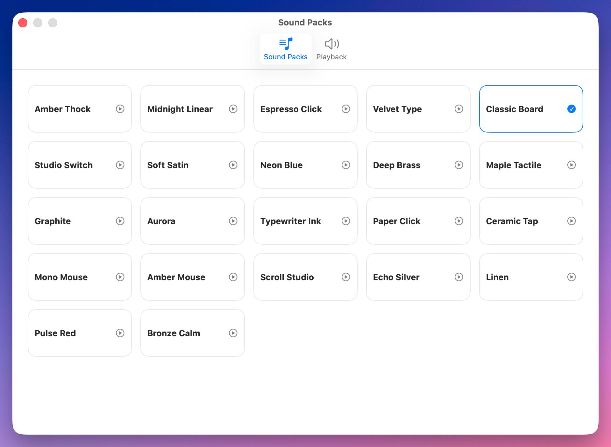

# TapThock

TapThock is a SwiftPM-only macOS menu bar app that adds mechanical keyboard, mouse-click, and scroll-wheel sounds to global input with a native onboarding flow and generated built-in sound packs.



## Requirements

- macOS 14 or later
- Xcode Command Line Tools or Xcode with a working Swift 6 toolchain

## Development

```bash
xcrun swift build
xcrun swift run TapThock
```

Logs are written to `~/Library/Logs/TapThock/` with rolling log files and a live `current.log`.

## Packaging

```bash
./install.command
./install.command --open
```

That script creates the app bundle from a release build, resets the app's Accessibility and Input Monitoring permission state, installs `TapThock.app` into `~/Applications`, and can optionally open it immediately with `--open`.
